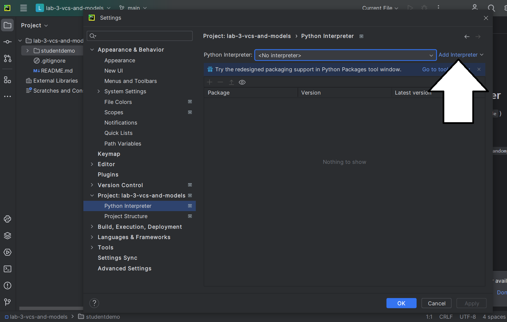
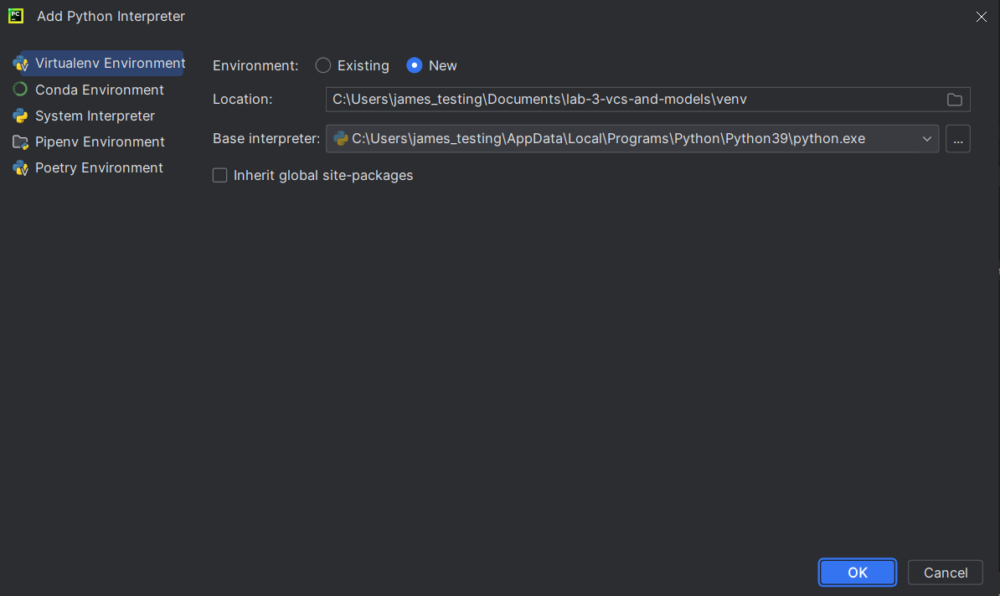
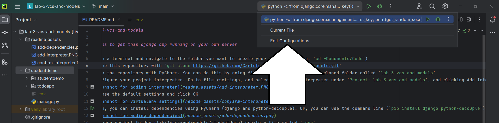
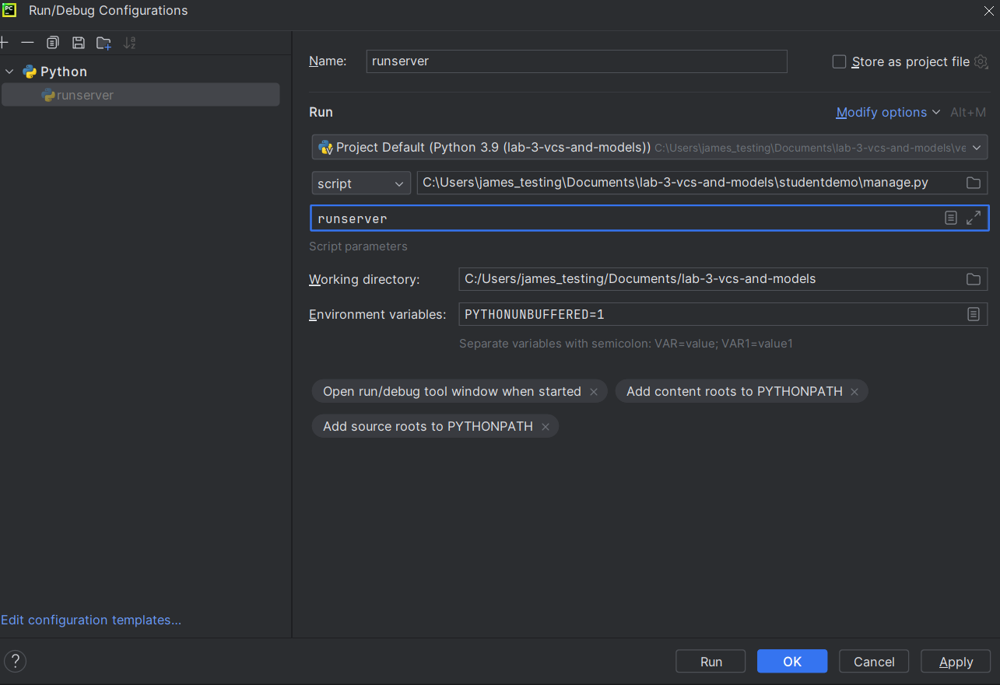

# term-project-template

*Do not submit this as your project README. I expect you to provide instructions for me, the instructor, to set up and run your application. To help you, this README currently provides some instructions to you, and I expect you to change it before you submit your backend deliverable.*

This is the repository that you should use as the template for your term project. It does not have any apps.

Note that the lab computers may have vim as a default editor for commits. Vim can be scary. I recommend using nano. You can ensure you are using nano by running this command: `git config --global core. editor "nano"`

## Steps to get this django application running on your own PC

1) Open a terminal and navigate to the folder you want to create your project in (e.g. `cd ~Documents/Code`)
2) Clone this repository with `git clone <link to this repository>`
3) Open the repository with PyCharm. You can do this by going file->open and selecting the cloned folder called
4) Configure your project interpreter. Go to file->settings, and selecting Python Interpreter and clicking Add Interpreter->Add Local Interpreter

5) Choose the default settings and click OK

6) Then, you can install dependencies using `pip install -r requirements.txt`
7) Create a run configuration:

8) Configure it to run manage.py with the parameter runserver:

9) Create a file called `.env` in the simple-todoapp-django folder
10) Generate a secret key by running `python -c 'from django.core.management.utils import get_random_secret_key; print(get_random_secret_key())'` in the terminal. Copy the output.
11) Edit `.env` (created in part 9) with a text editor like notepad, and add a line that says `SECRET_KEY="your-secret-key-here"`. Paste the output from part 10 into 'your-secret-key-here'.
12) On the terminal, run `python manage.py migrate` (this will only work if you have navigated to the correct folder in the terminal)
13) Run the server by clicking the play button for the run configuration you set up
14) Navigate to 127.0.0.1:8000! Your app should load.

## Mandatory Configuration Steps

1. Create a new **Django App** by running `python manage.py startapp <app_name>`. The app name should be relevant to the purpose of your project: e.g. `workouttracker` for a workout tracker.
2. Add the app to your list of INSTALLED_APPS in your `settings.py`
3. Create a `urls.py` in your app, and configure the `urls.py` in your project to include your app's `urls.py`
4. Create a simple "hello world" view

If you're having any trouble with this, I go over many of these setup steps in **Lecture 6**